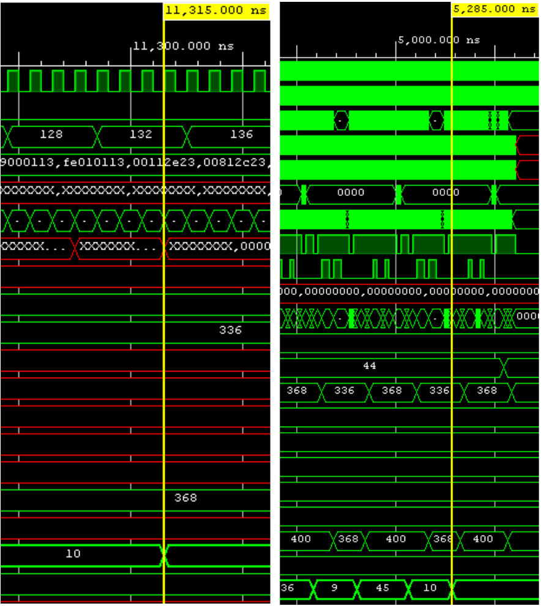
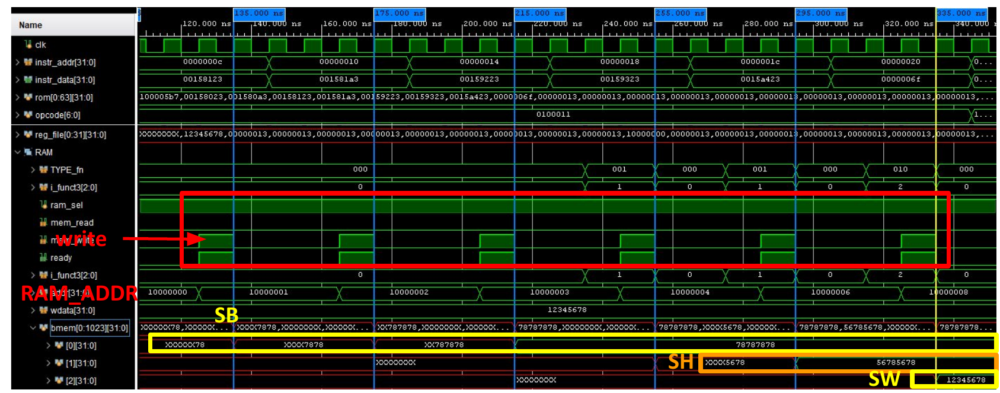
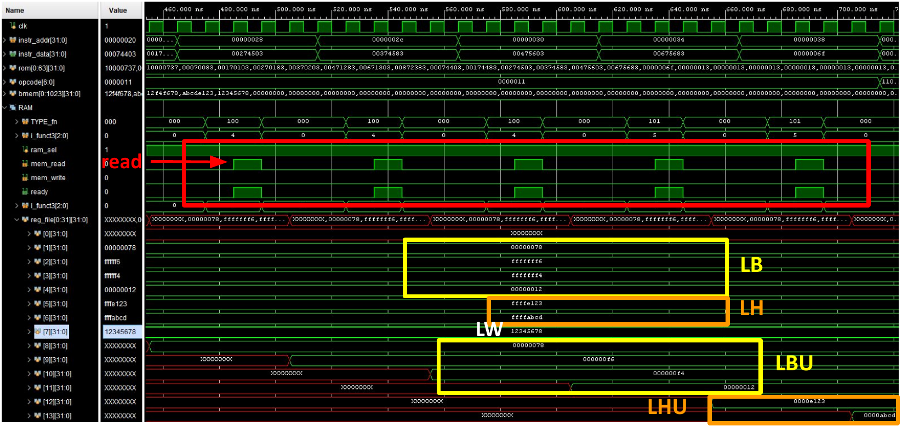
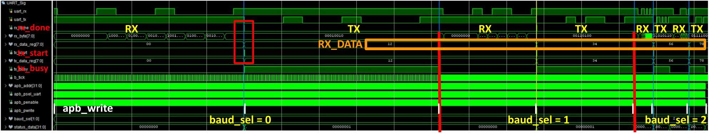
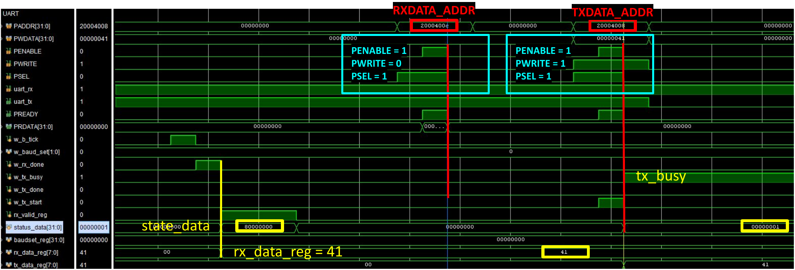
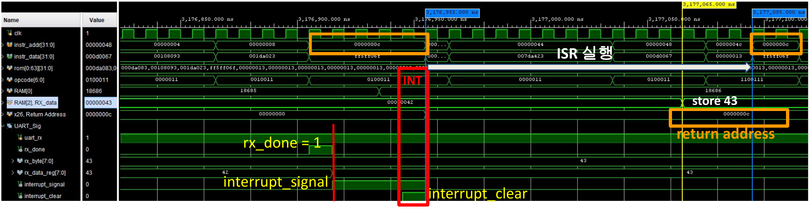

# RISC-V RV32I MCU

## Overview

SystemVerilog로 구현한 멀티사이클 RV32I CPU 기반 MCU 설계. CPU 코어, 명령어 ROM, 4 KB(4096 bytes) 데이터 RAM, APB 버스 및 GPIO, UART, FND 주변장치를 하나의 SoC 형태로 구성함.

기존 single-cycle RV32I CPU 설계를 기반으로 하며, 명령어 실행 과정을 `IF`, `ID`, `EX`, `MEM`, `WB` 단계로 분리한 multi-cycle 구조로 확장함.

Digilent Basys 3 보드를 대상으로 하며, 100 MHz 시스템 클럭과 온보드 스위치, LED, 7-Segment Display 및 USB-UART 인터페이스를 사용함.

## Specifications

- 32비트 RV32I 멀티사이클 CPU
- `IF`, `ID`, `EX`, `MEM`, `WB`, `INT` 상태 기반 제어
- 32개 범용 레지스터와 `x0` 하드와이어드 제로
- 64-word 명령어 ROM
- 4 KB(4096 bytes) 데이터 LUT RAM
- APB 기반 메모리 맵 주변장치
- 8비트 GPO 및 8비트 GPI
- 16비트 양방향 GPIO
- 4자리 7-Segment Display 제어기
- UART 송수신 및 RX 인터럽트
- Basys 3 보드용 XDC 파일

## System Architecture


`rv32i_mcu` TOP 모듈에서 명령어 메모리, RV32I CPU, Bus Router, 데이터 RAM, APB Master 및 APB 주변장치를 통합함. 명령어 메모리는 CPU와 직접 연결되며, CPU의 데이터 접근은 Bus Router에서 RAM 경로와 APB 주변장치 경로로 분기됨.

## CPU Architecture

CPU는 제어부(`control_unit`)와 데이터패스(`datapath`)로 구성됨.

| 상태 | 동작 |
| --- | --- |
| `IF` | 명령어 인출, 현재 PC 저장 및 다음 PC 갱신 |
| `ID` | 레지스터 피연산자와 즉시값 저장 |
| `EX` | ALU 연산, 분기·점프 처리 및 Load/Store 유효 주소 계산 |
| `MEM` | Load/Store 명령의 데이터 RAM 또는 APB 접근 |
| `WB` | ALU, Load, Immediate 및 Jump 결과를 레지스터에 기록 |
| `INT` | 복귀 주소 저장, 인터럽트 요청 해제 및 벡터 주소로 이동 |

### Supported Instructions

| 분류 | 명령어 |
| --- | --- |
| Register-Register | `ADD`, `SUB`, `SLL`, `SLT`, `SLTU`, `XOR`, `SRL`, `SRA`, `OR`, `AND` |
| Register-Immediate | `ADDI`, `SLTI`, `SLTIU`, `XORI`, `ORI`, `ANDI`, `SLLI`, `SRLI`, `SRAI` |
| Load | `LB`, `LH`, `LW`, `LBU`, `LHU` |
| Store | `SB`, `SH`, `SW` |
| Branch | `BEQ`, `BNE`, `BLT`, `BGE`, `BLTU`, `BGEU` |
| Jump | `JAL`, `JALR` |
| Upper Immediate | `LUI`, `AUIPC` |

## Single-Cycle vs. Multi-Cycle Execution Time

CPU 단독 시뮬레이션에서 동일한 0~10 누적 합산 프로그램을 실행하여 single-cycle과 multi-cycle의 수행시간을 비교함. 측정 기준은 `reg_file[10]`에 결과값 `55`가 저장되는 시점임.

| 비교 항목 | Single-cycle | Multi-cycle |
| --- | --- | --- |
| 시뮬레이션 클럭 주파수 | 50 MHz | 100 MHz |
| 클럭 주기 | 20 ns | 10 ns |
| 명령어 실행 방식 | 한 명령어를 1사이클에 실행 | 명령어별로 여러 FSM 상태를 순차 실행 |
| 측정 기준 | `reg_file[10] = 55` | `reg_file[10] = 55` |
| 프로그램 수행시간 | 약 **5.28 μs** | 약 **11.30 μs** |



*왼쪽: Multi-cycle(커서 11,315 ns) / 오른쪽: Single-cycle(커서 5,285 ns).*

Single-cycle은 타이밍 분석 결과 약 16 ns 이상의 클럭 주기가 필요하여 20 ns(50 MHz)로 설정하고, multi-cycle은 10 ns(100 MHz)로 설정함. 이 프로그램에서 multi-cycle의 클럭 주파수는 2배였지만 수행시간은 약 **2.14배** 길었음. 명령어당 필요한 사이클 수가 증가하므로, 클럭 주파수 향상이 곧 프로그램 실행시간 단축으로 이어지지는 않음.

```text
프로그램 실행시간 = 실행 명령어 수 × 평균 CPI × 클럭 주기
```

Multi-cycle 제어기의 명령어별 실행 경로는 다음과 같음. RAM 접근에 추가 대기가 없고 인터럽트가 발생하지 않는 경우를 기준으로 하며, APB 접근은 `bus_ready`를 기다리는 동안 `MEM` 상태가 연장됨.

| 명령어 종류 | FSM 실행 경로 | 사이클 수 |
| --- | --- | --- |
| ALU 연산, LUI/AUIPC, JAL/JALR | `IF → ID → EX → WB` | 4 |
| RAM Load | `IF → ID → EX → MEM → WB` | 5 |
| RAM Store | `IF → ID → EX → MEM` | 4 |
| Branch | `IF → ID → EX` | 3 |

한 명령어의 처리가 끝난 뒤 다음 명령어를 시작하므로, 전체 수행시간은 명령어 구성에 따른 평균 CPI와 클럭 주기에 의해 결정됨.

## Memory Map

| 기준 주소 | 크기 | 장치 |
| --- | --- | --- |
| `0x0000_0000` | 256 B | 명령어 ROM |
| `0x1000_0000` | 4 KB | 데이터 LUT RAM |
| `0x2000_0000` | - | GPO |
| `0x2000_1000` | - | GPI |
| `0x2000_2000` | - | GPIO |
| `0x2000_3000` | - | FND |
| `0x2000_4000` | - | UART |

데이터 RAM은 `addr[11:2]`를 32비트 word 인덱스로 사용함. 하위 2비트 `addr[1:0]`은 byte와 halfword 위치를 선택하는 데 사용되며, 소프트웨어에서는 `0x1000_0000`부터 `0x1000_0FFF`까지의 주소 범위를 사용함.

### RAM Access Architecture

데이터 RAM은 APB Slave로 연결되지 않으며, CPU 데이터 버스와 `bus_router`를 통해 직접 연결됨.

#### RAM Control Flow

1. CPU가 load 또는 store 명령어를 실행하면 `bus_addr`, `bus_wdata`, `bus_rreq`, `bus_wreq`를 출력함.
2. `bus_router`에서 `bus_addr[31:28] == 4'h1` 조건을 검사함.
3. 조건이 참이면 CPU 요청을 `ram_rreq` 또는 `ram_wreq`로 변환하여 `data_dmem`에 전달함.
4. `data_dmem`에서 `funct3` 값에 따라 byte, halfword, word 단위의 읽기 및 쓰기를 처리함.
5. Data RAM은 `addr[11:2]`를 이용하여 1024개의 32비트 word 중 하나를 선택함.
6. `ram_rdata`와 `ram_ready`가 `bus_router`를 통해 CPU의 `bus_rdata`와 `bus_ready`로 반환됨.

| CPU 명령어 | `funct3` | RAM 처리 |
| --- | --- | --- |
| `LB`, `LBU` | `000`, `100` | `addr[1:0]`으로 byte 선택 |
| `LH`, `LHU` | `001`, `101` | `addr[1]`로 halfword 선택 |
| `LW` | `010` | 32비트 word 읽기 |
| `SB` | `000` | 선택된 8비트 영역 쓰기 |
| `SH` | `001` | 선택된 16비트 영역 쓰기 |
| `SW` | `010` | 32비트 word 쓰기 |

`data_dmem`의 `ready`는 `mem_read | mem_write`로 생성됨. RAM 요청이 활성화되면 별도의 wait state 없이 완료 신호가 CPU 버스 경로로 반환됨.

#### Direct RAM Connection Rationale

APB는 `SETUP`과 `ACCESS` 단계로 구성된 저속 주변장치용 레지스터 버스임. 본 설계에서는 GPO, GPI, GPIO, FND, UART와 같이 소수의 제어 및 상태 레지스터를 갖는 주변장치를 APB에 연결함.

데이터 RAM은 CPU의 load/store 명령어에 의해 반복적으로 접근되는 저장공간이므로 APB 변환 단계를 거치지 않고 직접 연결함. 이를 통해 APB의 `SETUP` 및 `ACCESS` 단계에서 발생하는 접근 지연을 줄임. 해당 구조는 다음 특성을 가짐.

- APB의 `SETUP` 및 `ACCESS` 상태를 거치지 않고 RAM 요청을 직접 전달함
- CPU의 `funct3`를 이용한 byte, halfword, word 접근을 RAM 인터페이스에서 직접 처리함
- RAM 데이터 및 완료 신호를 `bus_router`에서 CPU로 직접 반환함
- 메모리 경로와 주변장치 경로를 분리하여 각 인터페이스의 역할을 명확하게 구성함

주소가 RAM 영역이 아닌 경우 `bus_router`에서 요청을 APB Master로 전달함. APB Master는 `0x2000_xxxx` 영역을 디코딩하여 각 주변장치의 `PSEL`을 생성함.

### GPO Registers

기준 주소: `0x2000_0000`

| Offset | 이름 | 접근 | 설명 |
| --- | --- | --- | --- |
| `0x000` | `GPO_CTL` | R/W | 비트가 1인 출력만 활성화 |
| `0x004` | `GPO_ODATA` | R/W | 8비트 LED 출력 데이터 |

### GPI Registers

기준 주소: `0x2000_1000`

| Offset | 이름 | 접근 | 설명 |
| --- | --- | --- | --- |
| `0x000` | `GPI_CTL` | R/W | 비트가 1인 입력만 읽기 활성화 |
| `0x004` | `GPI_IDATA` | R | 8비트 스위치 입력 데이터 |

### GPIO Registers

기준 주소: `0x2000_2000`

| Offset | 이름 | 접근 | 설명 |
| --- | --- | --- | --- |
| `0x000` | `GPIO_CTL` | R/W | 방향 설정: `1=output`, `0=input` |
| `0x004` | `GPIO_ODATA` | R/W | 16비트 출력 데이터 |
| `0x008` | `GPIO_IDATA` | R | 16비트 입력 데이터 |

### FND Registers

기준 주소: `0x2000_3000`

| Offset | 이름 | 접근 | 설명 |
| --- | --- | --- | --- |
| `0x000` | `FND_CTL` | R/W | Reserved (미사용) |
| `0x004` | `FND_ODATA` | R/W | 표시할 16비트 hexadecimal 값 |

`FND_ODATA`를 4비트 단위의 네 영역으로 분할하며, 각 4비트 값을 한 자리의 16진수 숫자로 표시함.

### UART Registers

기준 주소: `0x2000_4000`

| Offset | 이름 | 접근 | 설명 |
| --- | --- | --- | --- |
| `0x000` | `UART_BAUD` | R/W | Baud rate 선택 (`[1:0]`) |
| `0x004` | `UART_STATUS` | R | `[31]=RX valid`, `[0]=TX busy` |
| `0x008` | `UART_TXDATA` | R/W | 송신 데이터 (`[7:0]`) |
| `0x00C` | `UART_RXDATA` | R | 수신 데이터 (`[7:0]`) |

#### UART Baud Configuration

| `UART_BAUD[1:0]` | Baud rate |
| --- | --- |
| `2'b00` | 9,600 bps |
| `2'b01` | 19,200 bps |
| `2'b10` | 115,200 bps |

UART는 100 MHz 입력 클럭을 기준으로 16배 oversampling 방식을 사용함. 프레임 형식은 8 data bits, no parity, 1 stop bit(8N1)로 구성됨.

## Custom UART Interrupt Architecture

사용자 정의 인터럽트는 UART RX 수신 완료 신호를 기반으로 동작함. UART 수신 데이터는 `rx_data_reg`에 저장되며, `rx_valid_reg`는 수신 완료 후 인터럽트 수락 또는 `UART_RXDATA` Read 전까지 pending 플래그 역할을 수행함.

본 설계의 `interrupt_signal`은 UART RX valid flag 기반의 custom IRQ 역할을 하며, CPU는 이를 감지하면 `0x0000_0040`의 ISR 벡터로 분기함.

### 1. UART Reception and Interrupt Request

1. `uart_rx` 모듈에서 start bit, 8-bit data, stop bit를 순서대로 수신함.
2. 한 바이트의 수신이 완료되면 `w_rx_done`을 1로 설정함.
3. APB UART에서 수신 데이터를 `rx_data_reg`에 저장하고 `rx_valid_reg`를 1로 설정함.
4. `interrupt_signal`은 `rx_valid_reg`에 직접 연결되어 CPU로 전달됨.
5. 동일한 RX valid 상태를 `UART_STATUS[31]`을 통해 확인할 수 있음.

### 2. CPU Interrupt Entry

CPU 제어기는 `IF` 상태에서 `interrupt_signal`을 확인함. 명령어 실행 도중 인터럽트가 발생한 경우, 실행 중인 명령어의 상태 처리를 완료한 후 다음 `IF` 상태에서 인터럽트를 수락함.

인터럽트 감지 시 제어기가 `INT` 상태로 전이함. `INT` 상태에서 다음 제어 신호가 활성화됨.

| 제어 신호 | 동작 |
| --- | --- |
| `save_return_addr` | 복귀 주소 저장 |
| `pc_en` | PC 갱신 허용 |
| `pc_sel_int` | 인터럽트 벡터 선택 |
| `interrupt_clear` | UART RX valid 해제 요청 |

### 3. Return Address and Interrupt Vector

`save_return_addr` 활성화 시 데이터패스에서 현재 `instr_addr`를 범용 레지스터 `x26`에 저장함. 해당 값은 인터럽트 처리 완료 후 기존 프로그램으로 복귀하기 위한 주소로 사용됨.

동시에 PC 입력을 인터럽트 벡터 상수인 `0x0000_0040`으로 선택함. 명령어 ROM은 word 단위로 접근하므로 해당 벡터 주소는 ROM의 16번째 인덱스에 해당함.

| 항목 | 값 |
| --- | --- |
| 인터럽트 소스 | UART RX data valid |
| 인터럽트 감지 상태 | CPU `IF` 상태 |
| 인터럽트 벡터 | `0x0000_0040` |
| 복귀 주소 레지스터 | `x26` |
| pending 상태 | `UART_STATUS[31]` |

### 4. Interrupt Clear

CPU가 `INT` 상태에 진입하면 `interrupt_clear`가 활성화되어 `rx_valid_reg`가 해제됨. CPU의 인터럽트 진입 전에 소프트웨어에서 `UART_RXDATA` 레지스터를 읽는 경우에도 RX valid가 해제됨.

수신 완료와 clear가 동일한 클럭에 발생하는 경우 신규 수신 완료 처리가 우선되며, 수신 데이터와 RX valid 상태가 유지됨.

### 5. Program Return

인터럽트 서비스 루틴은 `0x0000_0040`부터 실행됨. UART 수신 데이터는 `UART_RXDATA`에서 읽으며, 서비스 처리 완료 후 `JALR` 명령으로 `x26`에 저장된 주소로 이동하여 인터럽트 발생 이전의 실행 위치로 복귀함.

## Functional Simulation and Board Test

검증용 프로그램을 기계어로 변환하여 명령어 ROM에 적재한 후 Vivado Functional Simulation 및 Basys 3 보드 테스트를 수행함.

| 테스트 항목 | 검증 환경 | 확인 내용 |
| --- | --- | --- |
| 0~10 누적 합산 | Vivado Functional Simulation | 0부터 10까지의 합산 결과 `55` 확인 |
| UART Echo Back | Basys 3 | UART 수신 데이터 재전송 및 FND ASCII 표시 확인 |
| UART Interrupt | Basys 3 | LED 순환 중 인터럽트 진입, ISR 실행 및 기존 위치 복귀 확인 |
| RAM Store / Load | Vivado Functional Simulation | 부분 쓰기, 읽기 크기 선택, 부호 확장 및 zero extension 확인 |
| UART Baud / APB | Vivado Functional Simulation | Baud 설정별 Echo 및 RXDATA 읽기·TXDATA 쓰기 확인 |
| UART Interrupt / RAM | Vivado Functional Simulation | 인터럽트 벡터 분기, 수신값 RAM 저장, 메인 프로그램 복귀 확인 |

### Sum Calculation

0부터 10까지의 값을 순차적으로 누적하는 프로그램을 명령어 ROM에 적재함. Vivado Functional Simulation 파형에서 최종 합산 결과가 10진수 `55`로 계산되는 것을 확인함. 해당 테스트는 시뮬레이션 환경에서만 수행함.

Single-cycle과 multi-cycle의 클럭 조건 및 수행시간은 [Single-Cycle vs. Multi-Cycle Execution Time](#single-cycle-vs-multi-cycle-execution-time)에 정리함.

### RAM Store / Load Waveforms

#### Store: Byte / Halfword / Word



*RAM base `0x1000_0000`에서 byte, halfword, word 단위로 데이터를 기록하는 파형.*

쓰기 데이터 `0x1234_5678`을 사용하여 `SB`, `SH`, `SW`에 따른 메모리 갱신 범위를 확인함.

| 접근 | 주소 / Offset | 쓰기 완료 후 결과 |
| --- | --- | --- |
| `SB` 4회 | RAM base + `0, 1, 2, 3` | 각 byte에 `0x78` 기록 → 첫 word `0x7878_7878` |
| `SH` 2회 | RAM base + `4, 6` | 각 halfword에 `0x5678` 기록 → 두 번째 word `0x5678_5678` |
| `SW` 1회 | RAM base + `8` | 세 번째 word `0x1234_5678` |

`SB/SH`는 기존 word에서 선택되지 않은 영역을 유지하고 대상 byte/halfword만 교체함. 파형에서는 `mem_write` 요청과 `ready`, 주소 및 메모리 값의 변화를 함께 확인할 수 있음. 비동기 읽기·동기 쓰기 구조이며, 쓰기는 요청이 활성화된 클럭 상승 에지에서 반영됨.

#### Load: Sign Extension / Zero Extension



*동일한 메모리 데이터에 대한 signed/unsigned load 결과 비교.*

| 비교 대상 | 읽은 원본 데이터 | Signed Load | Unsigned Load |
| --- | --- | --- | --- |
| Byte | `0xF6` | `LB` → `0xFFFF_FFF6` | `LBU` → `0x0000_00F6` |
| Halfword | `0xE123` | `LH` → `0xFFFF_E123` | `LHU` → `0x0000_E123` |
| Word | `0x1234_5678` | `LW` → `0x1234_5678` | 동일한 32비트 값을 읽음 |

테스트 메모리는 `0x12F4_F678`, `0xABCD_E123`, `0x1234_5678`로 초기화함. 동일한 메모리 값에 대해 `LB/LH`는 부호 비트를 상위 비트로 확장하고, `LBU/LHU`는 상위 비트를 0으로 채우는 차이를 확인함.

### UART Baud Rate / APB Waveforms



*Baud rate 설정에 따른 UART 수신 및 Echo 송신 파형.*

`baud_sel`을 `0 → 1 → 2`로 변경하며 9,600 / 19,200 / 115,200 bps에서 RX 이후 TX가 이어지는 Echo 동작을 확인함. 수신 데이터는 `0x12 → 0x34 → 0x56 → 0x78` 순서이며, `rx_done`, 수신 데이터 레지스터, `tx_start`, `tx_busy`를 함께 관찰함.



*9,600 bps에서 데이터 `0x41`의 RXDATA 읽기와 TXDATA 쓰기 동작.*

| 구간 | APB 접근 및 상태 변화 |
| --- | --- |
| 수신 완료 | `rx_data_reg = 0x41`, RX valid 설정 시 `UART_STATUS = 0x8000_0000` |
| RXDATA 읽기 | `PADDR = 0x2000_400C`, `PSEL = 1`, `PENABLE = 1`, `PWRITE = 0` |
| TXDATA 쓰기 | `PADDR = 0x2000_4008`, `PWDATA[7:0] = 0x41`, `PWRITE = 1`, `PSEL = PENABLE = 1` |
| 송신 시작 | `tx_start` 발생 후 `tx_busy = 1`; RX valid가 해제된 상태에서는 `UART_STATUS = 0x0000_0001` |

`UART_STATUS[31]`은 수신 완료 후 유지되는 `rx_valid_reg` 값임. RXDATA 읽기 또는 CPU의 `interrupt_clear`로 해제되며, TXDATA는 `TX busy = 0`일 때만 송신 요청을 수락하므로 소프트웨어에서 상태를 확인한 뒤 기록해야 함.

RX 데이터는 1바이트 레지스터에 저장되며 현재 APB UART 경로에 RX FIFO는 연결되어 있지 않음. 기존 데이터를 읽기 전에 다음 바이트가 수신되면 최신 값으로 덮어써짐.

### UART Echo Back

PC에서 UART로 입력한 데이터를 MCU가 수신한 후 동일한 데이터를 다시 송신하는 echo back 동작을 확인함. 수신 데이터의 ASCII 코드는 FND에 16진수로 표시함.

최근 두 개의 수신 데이터를 4자리 FND에 표시하며, 신규 데이터 입력 시 기존 값이 오른쪽에서 왼쪽으로 이동함. `A`, `B`, `C`를 순서대로 입력한 경우 ASCII 값은 다음과 같이 표시됨.

```text
0041 -> 4142 -> 4243
```

### UART Interrupt Branch / Return Waveform



*메인 루프 실행 중 UART 데이터 `0x43` 수신에 따른 ISR 진입, RAM 저장 및 복귀 파형.*

검증 프로그램은 메인 루프에서 `RAM[0]`을 1씩 증가시키고, ISR에서 UART 수신값을 `RAM[2]`에 저장하도록 구성함. 인터럽트 처리 순서는 다음과 같음.

1. UART 수신 완료 후 `rx_done`이 발생하고 `interrupt_signal`이 활성화됨.
2. CPU가 `IF`에서 요청을 수락하고 `INT` 처리 중 복귀 주소 `0x0000_000C`를 `x26`에 저장함.
3. ISR 진입 시 `interrupt_clear`로 pending을 해제하고 PC를 ISR 시작 주소 `0x0000_0040`으로 변경함.
4. ISR이 `UART_RXDATA`를 읽어 수신값 `0x43`을 `RAM[2]`(`0x1000_0008`)에 기록함.
5. `JALR`로 `x26`에 저장한 `0x0000_000C`로 복귀함. 이후 메인 루프의 `JAL`을 실행하여 PC가 `0x0000_0000`으로 돌아감.

```asm
# 검증 프로그램의 핵심 흐름 (레지스터 초기화 코드는 생략)
# x27 = 0x1000_0000, x31 = 0x2000_400C
# main_loop: 0x0000_0000
main_loop:
    lw   x1, 0(x27)
    addi x1, x1, 1
    sw   x1, 0(x27)
    jal  x0, main_loop

# uart_isr: 0x0000_0040
uart_isr:
    lw   x7, 0(x31)
    sw   x7, 8(x27)
    jalr x0, 0(x26)
```

예제는 메인 루프와 ISR의 핵심 명령어를 나타냄. 실행 시 `x27`, `x31`을 초기화하고 ISR을 `0x0000_0040`에 배치해야 함. 인터럽트는 고정 벡터와 `x26`을 사용하는 custom 구조이며 CSR 기반 trap 처리는 구현하지 않음. ISR 재진입을 막는 마스크가 없어 처리 중 추가 수신 시 `x26`이 덮어써질 수 있으며, ISR에서 사용하는 레지스터의 보존도 소프트웨어에서 관리해야 함.

### UART Interrupt Board Test

메인 프로그램에서 보드 LED가 순차적으로 이동하는 반복 동작을 수행함. UART 데이터 수신 시 CPU가 인터럽트 벡터 `0x0000_0040`으로 분기하여 ISR을 실행함.

ISR에서는 LED 점등 동작을 3회 수행함. ISR 완료 후 `x26`에 저장된 복귀 주소를 이용하여 인터럽트 발생 이전의 LED 순환 위치로 복귀하고, 기존 반복 동작을 계속 수행하는 것을 확인함.

## Basys 3 Pin Mapping

| FPGA 포트 | Basys 3 장치 |
| --- | --- |
| `clk` | 100 MHz oscillator |
| `rst` | Center push button |
| `sw[7:0]` | 상위 8개 슬라이드 스위치 (GPI) |
| `led[7:0]` | 상위 8개 LED (GPO) |
| `GPIO[7:0]` | 하위 8개 슬라이드 스위치 |
| `GPIO[15:8]` | 하위 8개 LED |
| `fnd_digit[3:0]` | 7-Segment digit enable |
| `fnd_data[7:0]` | 7-Segment segments and decimal point |
| `uart_rx`, `uart_tx` | USB-UART interface |

## Directory Structure

```text
RV32I_MCU/
├── README.md
├── riscv1.png
├── rv32i_diagram.png
├── docs/
│   └── images/                 # 수행시간 비교 및 RAM/UART 검증 파형
├── single_cycle/
│   ├── constrs_1/
│   │   └── imports/FPGA_1/
│   │       └── Basys-3-Master.xdc
│   └── sources_1/
│       └── core/
│           ├── _define.vh
│           ├── _rv32i_rom_data.mem
│           ├── rv32I_top.sv
│           ├── rv32i_cpu.sv
│           ├── datapath.sv
│           ├── instruction_mem.sv
│           └── data_memory.sv
└── multi_cycle/
    ├── constrs_1/
    │   └── imports/FPGA_1/
    │       └── Basys-3-Master.xdc
    └── sources_1/
        ├── imports/new/
        │   ├── _define.vh
        │   ├── rv32I_top.sv
        │   ├── rv32i_cpu.sv
        │   ├── datapath.sv
        │   ├── instruction_mem.sv
        │   └── data_memory.sv
        └── new/
            ├── _riscv_rv32i_rom_data.mem
            ├── abp_master.sv
            ├── apb_uart.sv
            ├── apb_fnd.sv
            ├── gpo_01.sv
            ├── gpi_02.sv
            ├── gpio_03.sv
            ├── data_ram.sv
            ├── uart_top.sv
            └── fifo.sv
```

`single_cycle/`은 기반이 된 RV32I single-cycle CPU 설계이며, `multi_cycle/`은 이를 multi-cycle CPU와 APB 기반 주변장치를 포함하는 MCU 구조로 확장한 설계임.

`multi_cycle/sources_1/imports/new/data_memory.sv`는 초기 CPU 구조에서 사용한 1 KB 데이터 메모리 모듈이며, 현재 `rv32i_mcu` TOP에서는 `multi_cycle/sources_1/new/data_ram.sv`의 4 KB Data RAM을 사용하므로 설계에 연결되지 않음.

## Program ROM

`instruction_mem`에서 다음 파일을 `$readmemh`로 읽어 프로그램을 초기화함.

```text
multi_cycle/sources_1/new/_riscv_rv32i_rom_data.mem
```

메모리 초기화 파일은 한 줄에 하나의 32비트 명령어를 hexadecimal 형식으로 기록함.

```text
10001137
fe010113
00112e23
```

ROM 깊이는 64 word이며, 최대 256 byte의 프로그램을 저장할 수 있음. 프로그램 변경 사항은 synthesis 및 bitstream 생성 과정에서 명령어 ROM에 반영됨.

기본 ROM에는 RAM·GPO·GPI 접근 프로그램이 포함됨. UART Echo 및 인터럽트 테스트에는 해당 테스트용 ROM을 별도로 적재해야 하며, 테스트별 ROM과 testbench 전체는 저장소에 포함되어 있지 않음.

## Development Environment

- HDL: SystemVerilog
- FPGA board: Digilent Basys 3 (Xilinx Artix-7 XC7A35T)
- Tool: AMD/Xilinx Vivado
